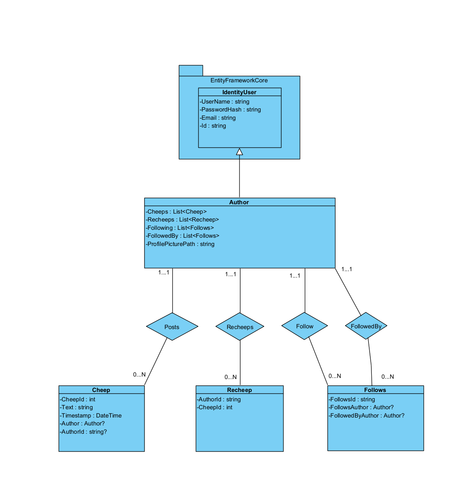
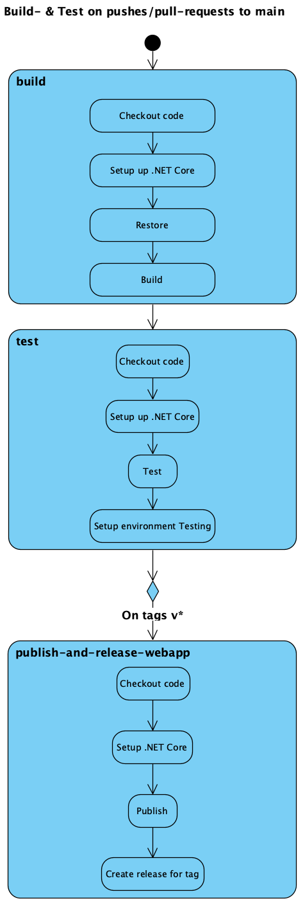

# Design and Architecture of _Chirp!_

## Domain model

Chirp has the following key entities:

    - Author: Enables user management through extending ASP.NETs IdentityUser
    - Cheep: Represents posts by authors using timestamps and text.
    - Follows: Tracks following, and being followed by, other authors.
    - Recheep: Allows reposting specific cheeps by other authors on our own timeline.
    
Below is an UML class diagram of our domain model: 

- **NOTE:** `IdentityUser` only shows the first part of the library it comes from in the diagram.  
  The full library path is:  
  `Microsoft.AspNetCore.Identity.EntityFrameworkCore.IdentityUser`

- **NOTE:** While not shown in the diagram, all three classes connected to **Author**  
  (`Cheep`, `Recheep`, and `Follows`) use  
  `System.ComponentModel.DataAnnotations` to support `required` parameters, among others.

## Architecture — In the small
The Onion Architecture of Chirp is seen in the below UML. 

    - UI Layer: Outer layer seen by the Client. Includes Pages, Identity Core scaffolded Pages, Startup code through Program.cs.
    - Service Layer: Data flow between our repository, the UI layer and the Client.
    - Repository Layer: Functionality, DTOs, Interfaces and database retrieval methods supported by Entity Core.
    - Domain Layer: Contains our domain entities only.

## Architecture of deployed application
The Deployed Application Architecture can be seen below.

#### Remote Architecture
Client interacts with an Azure Database through an HTTP (Converted to HTTPS) request. Hosted offshore. 

#### Local Architecture 
Client interacts directly with a local database. Does not require internet.

## User activities
We have two types of users: `Authorized `and `Unauthorized`.

**Access Restriction**

An `Unauthorized User` may...

    - Login and Register 
    - View Public and Private timelines
    - View multiple pages of content

An `Authorized User` may...

    - Logout
    - View Public and Private timelines
    - View own Timeline, with own posted Cheeps
    - View multiple pages of content
    - Access an "About me" page, with account information and account deletion ("Forget me")
    - Set a Profile Picture in the "About me" page
    - Post new Cheeps
    - Recheep other Authors' Cheeps

## Sequence of functionality/calls trough _Chirp!_
Below is a Diagram of an example functionality call of an Unauthorized user accessing the site, causing us to display all cheeps, which are grabbed from the database.

# Process

## Build, test, release, and deployment
We have created three workflows for the different tasks:
- **CI:** Automatically builds and tests the application on every change, and publishes a versioned release artifact when a release tag is pushed.
- **CD:** Build and deploy to Azure Web App.
- **Executables:** Builds, tests, and publishes single-file executables for multiple operating systems when a GitHub release is created.

The first diagram is over our Continuous Integration workflow, which ensures build- and test correctness. In addition it publishes release artifacts on version tags.

## Team work

## How to make _Chirp!_ work locally

## How to run test suite locally

# Ethics

## License

## LLMs, ChatGPT, CoPilot, and others
