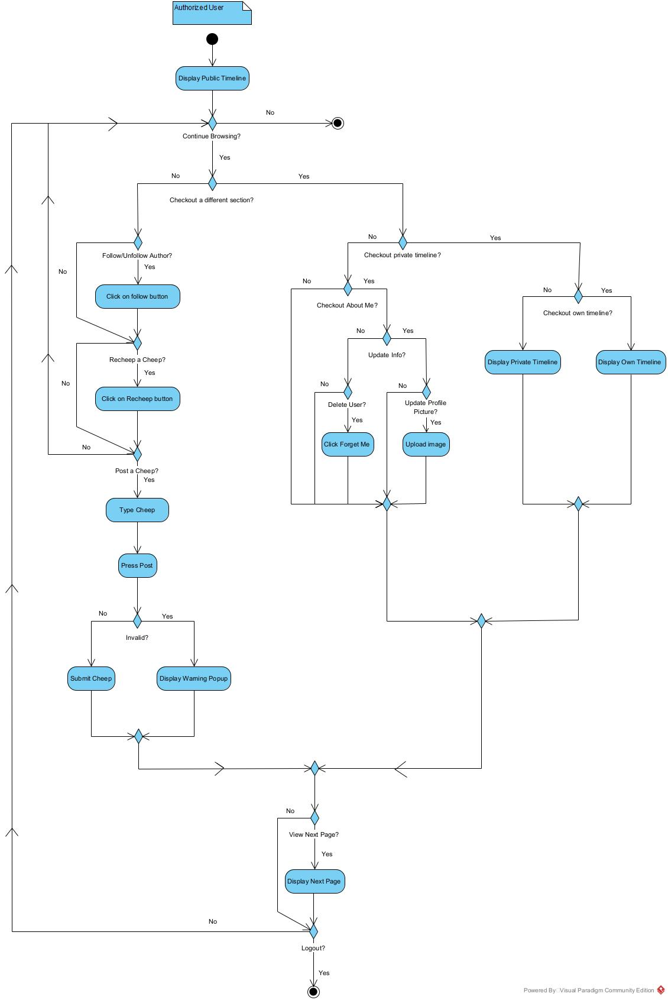
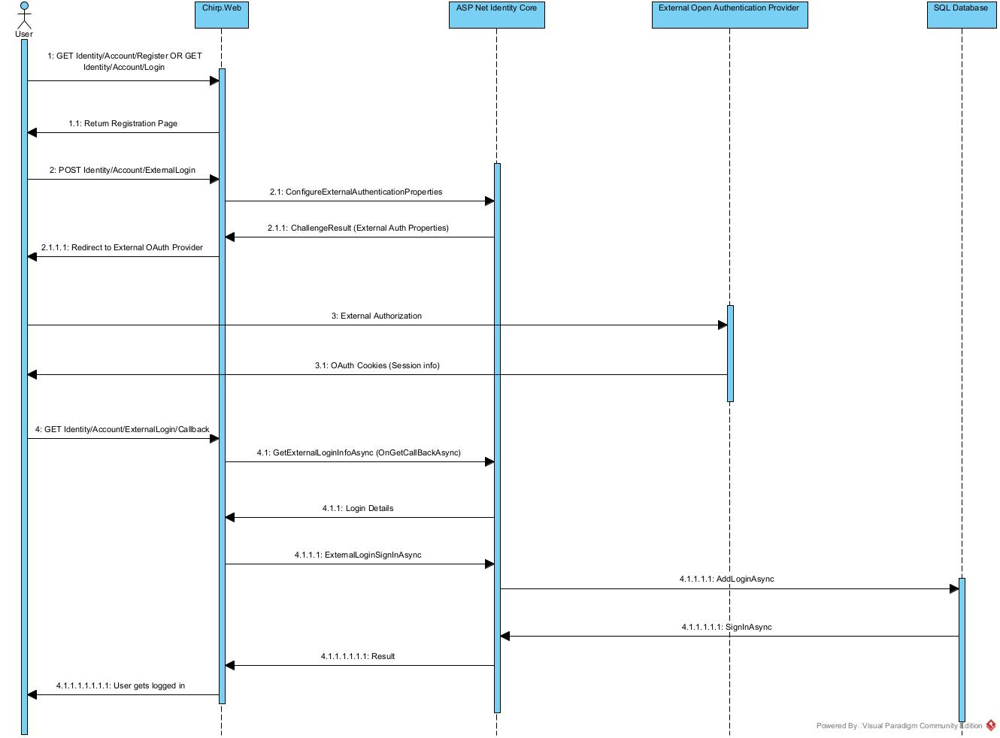
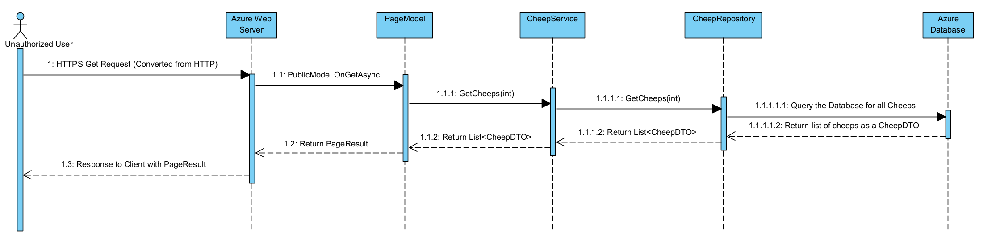
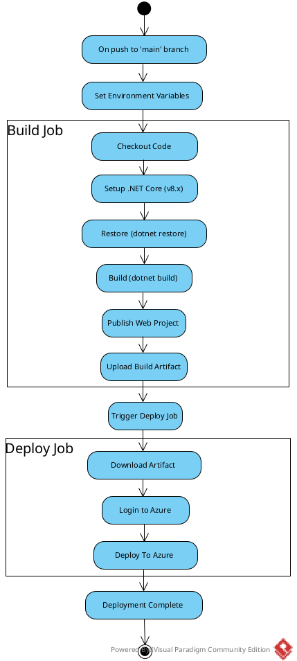
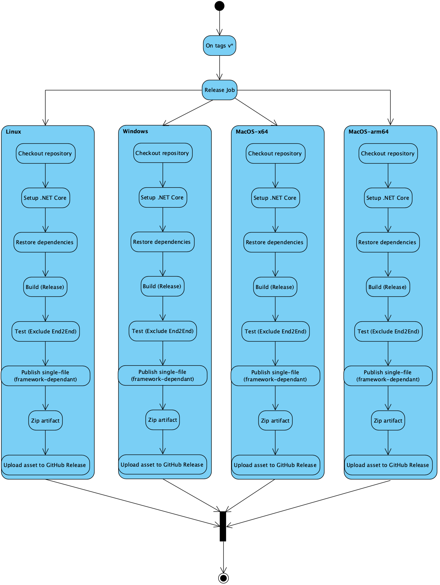
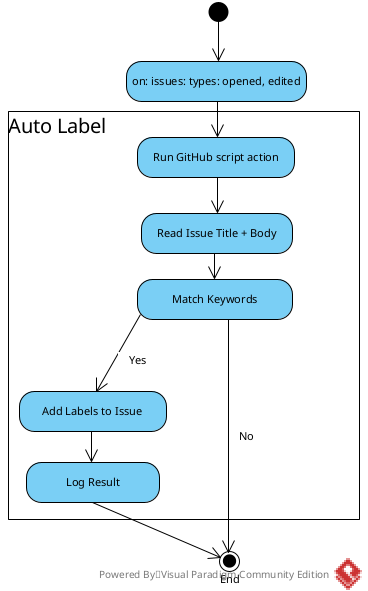
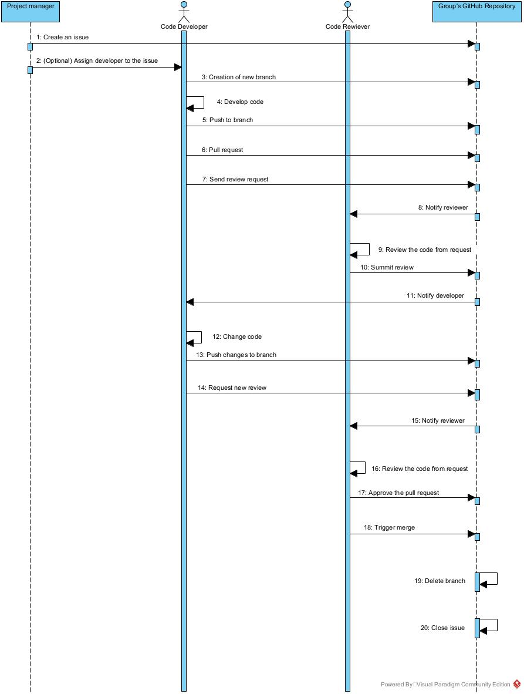

# Design and Architecture of _Chirp!_

## Domain model

Chirp has the following key entities:

    - Author: Enables user management through extending ASP.NETs IdentityUser
    - Cheep: Represents posts by authors using timestamps and text.
    - Follows: Tracks following, and being followed by, other authors.
    - Recheep: Allows reposting specific cheeps by other authors on our own timeline.
    
Below is a UML class diagram of our domain model: 


- **NOTE:** `IdentityUser` only shows the first part of the library frm which it comes from in the diagram.  
  The full library path is:  
  `Microsoft.AspNetCore.Identity.EntityFrameworkCore.IdentityUser`

- **NOTE:** While not shown in the diagram, all three classes connected to **Author**  
  (`Cheep`, `Recheep`, and `Follows`) use  
  `System.ComponentModel.DataAnnotations` to support `required` parameters, among others.


## Architecture — In the small
The Onion Architecture of Chirp is seen in the below UML. 

    - UI Layer: Outer layer seen by the Client. Includes Pages, Identity Core scaffolded Pages, Startup code through Program.cs.
    - Service Layer: Data flow between our repository, the UI layer and the Client.
    - Repository Layer: Functionality, DTOs, Interfaces and database retrieval methods supported by Entity Core.
    - Domain Layer: Contains our domain entities only.


## Architecture of deployed application
The Deployed Application Architecture can be seen below.


#### Remote Architecture
Client interacts with an Azure Database through an HTTP (Converted to HTTPS) request. Hosted offshore. 


#### Local Architecture 
Client interacts directly with a local database. Does not require internet.


## User activities
We have two types of users: `Authorized `and `Unauthorized`.

**Access Restriction**

An `Unauthorized User` may...

    - Login and Register 
    - View Public and Private timelines
    - View multiple pages of content

An `Authorized User` may...

    - Logout
    - View Public and Private timelines
    - View own Timeline, with own posted Cheeps
    - View multiple pages of content
    - Access an "About me" page, with account information and account deletion ("Forget me")
    - Set a Profile Picture in the "About me" page
    - Post new Cheeps
    - Recheep other Authors' Cheeps

### Unauthorized User Diagram


### Authorized User Diagram


## User Activities - Expanded Login Diagrams

### Standard Login (Typing in details on the Registration or Login page)


### Open Authentication Login


## Sequence of functionality/calls through _Chirp!_
Below is a Diagram of an example functionality call of an Unauthorized user accessing the site, causing us to display all cheeps, which are grabbed from the database.


# Process

## Build, test, release, and deployment
We have created three workflows for the different tasks:
- **CI:** Automatically builds and tests the application on every change, and publishes a versioned release artifact when a release tag is pushed.
- **CD:** Build and deploy to Azure Web App.
- **Executables:** Builds, tests, and publishes single-file executables for multiple operating systems when a GitHub release is created.
- **Auto Label:** Automatically labels issues based on keywords.

The first diagram is over our Continuous Integration workflow, which ensures build- and test correctness. In addition it publishes release web app artifact on tags, with both title and release notes.


The second diagram illustrates the Continuous Deployment workflow, which consists of a build- and deploy job. This workflow is triggered on 'push' to the main branch.
The workflow ensures that the ASP.NET application is built, published, and deployed to Azure App Service. The workflow does not include a dedicated test step, as this is done in CI.



The third diagram is for releasing executables. When a version tag and release is created, the workflow builds, tests, and publishes four platform-specific executables (Linux, Windows, and macOS for both x64 and arm64), which are packaged and uploaded to the GitHub release.



The fourth diagram is created over the Auto Label workflow. It shows how labels are automatically assigned to newly opened or edited issues based on predefined keywords, such as "bug", "layout", etc. 




## Team work
The structure around which we have organized our work can be described with the following sequence diagram.


As illustrated in the picture, our process had the following main components:

- **Creating an issue:** During the first two steps of the sequence, the project manager creates a new issue. This issue is based either on the requirements presented the given week or on bugs found during development. After creating the issue, including a description and success requirements, a developer can be assigned to it.
- **Code development:** The issue is then picked up by a developer from the team. In the next steps of the sequence, the developer creates a new designated branch for the issue, develops the feature, pushes the code to the GitHub repository, and finally requests review of the implemented code.
- **Code review:** GitHub then notifies the team about the pull request, and a reviewer reviews the code. The review is based on the success criteria defined when the issue was created. The reviewer submits the review through GitHub, which then notifies the developer whether the pull request was approved, or if changes are requested. If changes are requested, the developer updates the code, pushes the changes and sends a new review request thorugh the GitGub repository. If the pull request is approved, the sequence continues to the merge step.
- **Closing the issue:** Once the pull request is merged, the branch is deleted and the issue is closed. The process starts again, with the creation of a new issue.

### Snippet of Final Scrum Board
We used a Scrum Board to keep track of current issues and their status.


### Unresolved Tasks
We did not manage to cover all test cases for the initial part of the project (Chirp.Razor).
We have prioritized getting Azure to work, but encountered issues with it during the final phases of the Follows functionality. Currently, we believe it to be functioning, but our Quota is exceeded. We hope to be able to test it around the date of delivery, when Quota resets.


## How to make _Chirp!_ work locally
### Prerequisites
- .NET 8 SDK
- Git

### Clone Repository
Open a terminal and navigate to preferred directory. 
Then, run:
```
git clone https://github.com/ITU-BDSA2025-GROUP6/Chirp.git
cd Chirp
```
The project files should now be visible in the terminal.

### Restore Dependencies
Install all required dependencies and tools for the project by running:
```
dotnet restore
```
A confirmation message should indicate that all packages have been restored successfully or that all projects are up-to-date for restore.

### (Optional) Add Open Authentication Secrets
####  Initialize User Secrets Storage
Run the following in the terminal:
```
dotnet user-secrets init
```

#### Set Github Secrets
```
dotnet user-secrets set "authentication:github:clientId" "<ClientId>"
dotnet user-secrets set "authentication:github:clientSecret" "<ClientSecret>"
```

#### Set Google Secrets
```
dotnet user-secrets set "authentication:google:clientId" "<ClientId>"
dotnet user-secrets set "authentication:google:clientSecret" "<ClientSecret>"
```

### Run Application
From project root directory, start the application by running:
```
dotnet run --project src/Chirp.Web/Chirp.Web.csproj
```
The terminal should display messages indicating that the application is building and starting.

### Access the Application
Once the application is running, open a browser and navigate to:
```
https://localhost:5273
```
The *Chirp!* web interface should now be running locally.

## How to run test suite locally
After cloning the project repository, you can run the entire test suite or individual types of tests using
the following steps:

### 1. Install Required Browsers for Playwright
The E2E tests use Playwright, so browser binaries need to be installed locally.  
From the project root, run:
```
pwsh bin/Debug/net8.0/playwright.ps1 install --with-deps
```
If `pwsh` is not available, install PowerShell first.

This step is required for the E2E tests to run correctly.

For any issues with Playwright or browser installation, see the official guide:
https://playwright.dev/dotnet/docs/intro

### 2. Run All tests:
From the project root directory, run the command:
```
dotnet test
```
This will run all test cases across the project, including unit, integration, and end-to-end tests.

### 3. Run Specific Test
Each type of test can also be run separately from the project root:
- Unit tests:
```
dotnet test test/UnitTests
```

- Integration tests:
```
dotnet test test/IntegrationTests
```

- E2E tests:
```
dotnet test test/End2End
```

# Ethics

## License
During this project, we have learned about the importance of licensing and the ethics of open source developement. This has added new understanding and new perspectives to the reality surrounding the Chirp! application. For licensing, we haven chosen the MIT License. This choice is based on the simplicity of the license, as well as the its broad use and familiarity. Having this lisence means that others are free to use, modify and distribute our application, as long as the original license and copyright notice are included.

## LLMs, ChatGPT, CoPilot, and others
ChatGPT and Copilot have been utalized in the making of this project. These LLMs were used primarily for debugging and understanding different frameworks. Deployment to Azure was especially difficult, and Copilot aided in correctly resolving the issues based on Azure logs.
